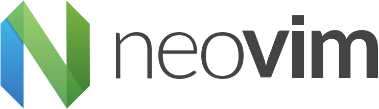
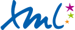

## Methodology              <!-- {{{ -->

1. screen prototype + study rust/-gtk4
2. translate screen prototype to xml + make an activity diagram of the app
3. start coding

### Tools used               <!-- {{{ -->

#### [Neovim](https://neovim.io/)

Neovim is a fork of the [Vim](https://www.vim.org/) text editor, engineered for extensibility and
usability, to encourage new applications and contributions. Just like vim, neovim allows the user to
add or create plugins to their setup.

---

#### [Git](https://git-scm.com/)

Git is a distributed version control system that tracks changes in any set of computer files. Its
goals include speed, data integrity, and support for distributed, non-linear workflows.

---

#### [Github](https://github.com/)

GitHub is a platform and cloud-based service for software development and version control using Git,
allowing developers to store and manage their code online.

---

#### [PlantUML](https://plantuml.com/)

PlantUML is a free and open-source drawing tool that allows users to create diagrams from a simple
and human readable text description.

I used PlantUML for this project because it allowed me to easily create an activity diagram of my
application without having to spend too much time on the appearence.

---

#### [Rust](https://www.rust-lang.org/)

Rust is a multi-paradigm, general-purpose programming language that emphasizes performance, type
safety, and concurrency. It enforces memory safety by ensuring that all references point to valid
memory, without the need of a garbage collector.

---

#### [XML](https://www.w3.org/XML/)

XML (Extensible Markup Language) is a markup language and file format for storing, transmitting, and
reconstructing arbitrary data. Its goals are to emphasize simplicity, generality, and usability
across the Internet.

---

#### [GTK](https://gtk.org/)

GTK is a free and open-source, cross-platform, object-oriented widget toolkit for creating Graphical
User Interfaces (GUIs). It's written in C with GObject, to enable support for the object-oriented
capabilities.

For this project I used the gtk4-rs package, since it provides safe bindings to the Rust programming
language for the GTK4 library.

---

#### Libadwaita

Libadwaita is an project that serves to extend GTK's base widgets with those specifically conforming
to the GNOME Human Interface Guidelines (HIG).

<!-- }}} -->

<!-- }}} -->
